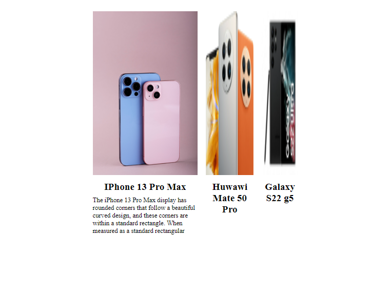

## Lab 5 (JQuery)

### (Task 1 Image Slider)

- The purpose for this task to animate the images continuously and stop this animation when clicking on stop button .

### Task 2 (Show Image Description)

- The purpose for this task to show the description of the image when clicking image and hide the description also when clicking on image .

