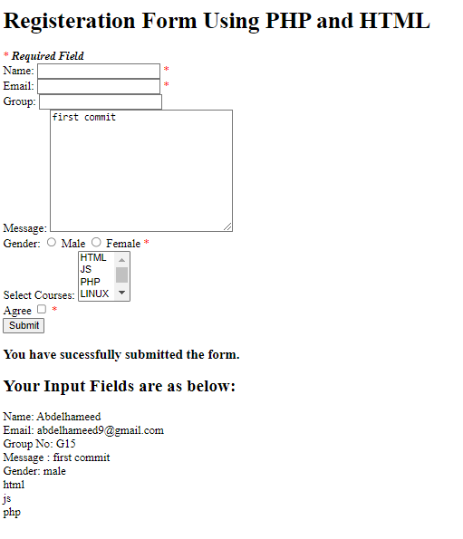
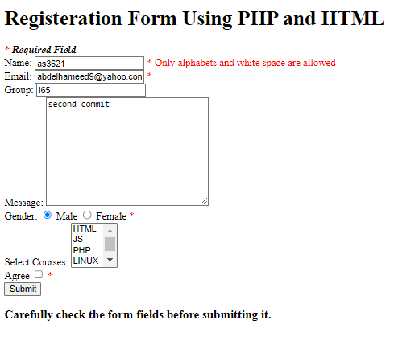
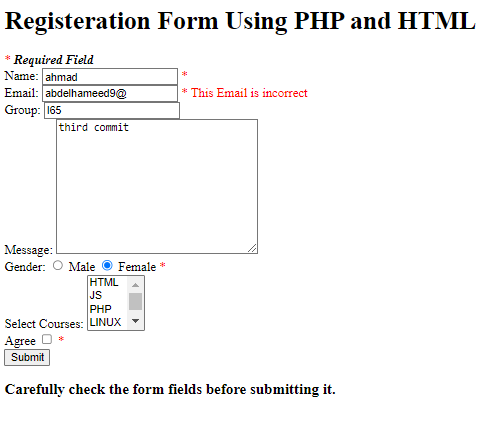
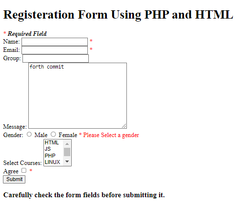
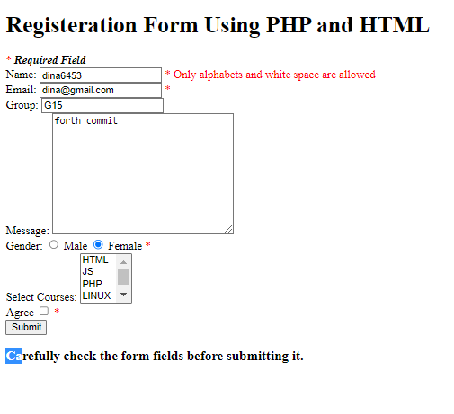

## Lab 3 - Form Validation

#### Introduction : in this lab we will set some validation on form to make users insert right data and also keep values when validation failed

##### Some situations while inserting in Form

